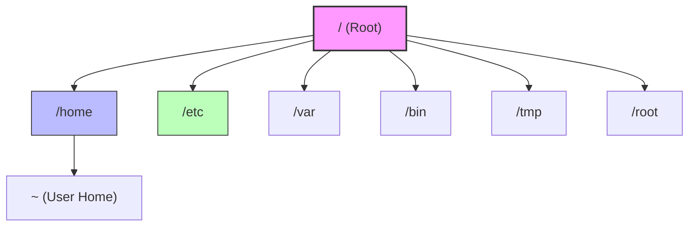

# 📂 Day 1: Linux Directory Structure

> - Understanding the **Linux File System** is like learning the map of a new city. Everything in Linux is a file, and every file has a place.\*

---

## 🌳 The Linux Directory Tree

In Linux, everything starts from the **Root** (`/`). It's the base of the tree from which all other directories branch out.

---

## 🗺️ Key Directories Explained

| Directory           | Symbol  | Description                                                                      |
| :------------------ | :-----: | :------------------------------------------------------------------------------- |
| **Root**            |   `/`   | The starting point of the filesystem. The "God" directory containing everything. |
| **User Home**       | `/home` | Contains personal directories for users (e.g., `/home/usman`).                   |
| **Home Shortcut**   |   `~`   | A quick shortcut to the current user's home (e.g., `cd ~` takes you home).       |
| **Super User Home** | `/root` | The private home directory for the System Administrator (Root user).             |
| **Binaries**        | `/bin`  | The **Toolbox**. Contains essential commands like `ls`, `cp`, `cat`.             |
| **Variables**       | `/var`  | Stores changing data like system logs (`/var/log`).                              |
| **Temporary**       | `/tmp`  | Scratchpad space. Files here are often deleted on reboot.                        |

---

## ⚙️ The Configuration Hub: `/etc`

> 🕵️ **Hacker's Note:** This directory is a goldmine for understanding how a system is configured.

The `/etc` directory acts as the system's **Rule Book**. It controls who can do what, network settings, and startup scripts.

### 🔑 Critical Files in `/etc`

1. **`/etc/passwd`**  
   📝 _List of all users on the system._
2. **`/etc/shadow`**  
   🔐 _Stores hashed passwords (highly sensitive)._
3. **`/etc/sudoers`**  
   🛡️ _The definition of "Who can be Admin". Controls `sudo` privileges._

---

**[Next Checkpoint: Day 2 - Shortcuts & Commands ➡️](./Day-2%20Shortcuts%20and%20Basic%20Commands.md)**

