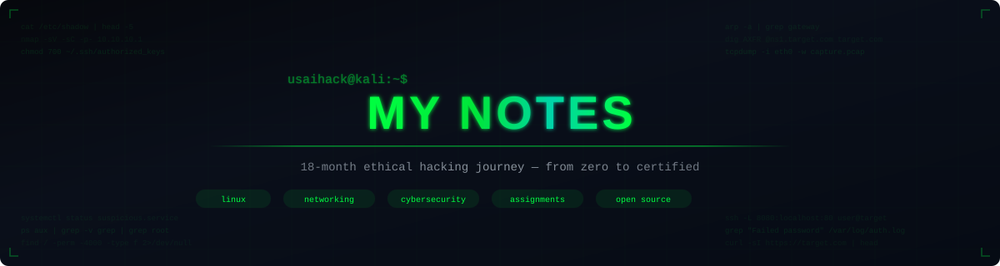

<p align="center">
  
</p>

<p align="center">
  <code>usman@usaihack:~$</code> <strong>My 18-month open-source ethical hacking journey — notes, assignments, and hands-on labs.</strong>
</p>

<br/>

<p align="center">
  <a href="https://github.com/usaihack/My-Notes/stargazers"></a>
  <a href="https://github.com/usaihack/My-Notes/network/members"></a>
  <a href="https://github.com/usaihack/My-Notes/issues"></a>
  <a href="LICENSE"></a>
  <a href="https://github.com/usaihack/My-Notes/commits"></a>
  <a href="https://github.com/usaihack/My-Notes"></a>
</p>

<br/>

<p align="center">
  
</p>

---

## `> whoami`

This repository is my **18-month open-source ethical hacking journal** — a living document of everything I learn, practice, and master on my path from beginner to certified pentester.

Every note is written in my own words, from real hands-on practice. No copy-paste. No fluff. Just raw learning with a cybersecurity lens.

```
┌──────────────────────────────────────────────────────────┐
│                                                          │
│  "Don't memorize commands. Build instincts."             │
│                                                          │
│  You don't learn hacking by reading about it.            │
│  You learn it by breaking things, fixing things,         │
│  and hunting through systems like your career            │
│  depends on it — because it does.                        │
│                                                          │
└──────────────────────────────────────────────────────────┘
```

### Who is this for?

| Audience | Why this helps |
|:---------|:---------------|
| **Beginners** | Starting from zero? Follow my path — every concept is explained like I'm explaining it to myself |
| **CTF Players** | Solid fundamentals before you touch a box on HackTheBox or TryHackMe |
| **Students** | Tired of boring theory? This is hands-on, scenario-driven, security-first |
| **Career Switchers** | Real notes from a real journey — with the struggles and breakthroughs included |

---

## `> cat /etc/roadmap`

### The 18-Month Roadmap

This journey covers **all major ethical hacking domains**, month by month:

```
╔═══════════════════════════════════════════════════════════════════════╗
║                                                                       ║
║   M01  ░░ Linux Fundamentals         ████████████████████░  COMPLETE  ║
║   M02  ░░ Networking Basics          ██████████░░░░░░░░░░  ACTIVE    ║
║   M03  ░░ Revision & Deep Networking ░░░░░░░░░░░░░░░░░░░░  UPCOMING  ║
║   M04  ░░ Web Application Security   ░░░░░░░░░░░░░░░░░░░░  UPCOMING  ║
║   M05  ░░ System Exploitation        ░░░░░░░░░░░░░░░░░░░░  UPCOMING  ║
║   M06  ░░ Wireless & IoT             ░░░░░░░░░░░░░░░░░░░░  UPCOMING  ║
║   M07  ░░ Social Engineering         ░░░░░░░░░░░░░░░░░░░░  UPCOMING  ║
║   M08  ░░ Malware Analysis           ░░░░░░░░░░░░░░░░░░░░  UPCOMING  ║
║   M09  ░░ Active Directory           ░░░░░░░░░░░░░░░░░░░░  UPCOMING  ║
║   M10  ░░ Cloud Security             ░░░░░░░░░░░░░░░░░░░░  UPCOMING  ║
║   M11  ░░ Red Teaming                ░░░░░░░░░░░░░░░░░░░░  UPCOMING  ║
║   M12  ░░ Defensive / Blue Team      ░░░░░░░░░░░░░░░░░░░░  UPCOMING  ║
║   M13+ ░░ Advanced Topics & Certs    ░░░░░░░░░░░░░░░░░░░░  UPCOMING  ║
║                                                                       ║
╚═══════════════════════════════════════════════════════════════════════╝
```

---

## `> ls -la /modules/`

### Module Breakdown

<details open>
<summary><b>MONTH 01 — FEEL KALI AS A HOME</b> &nbsp; <code>COMPLETE</code> &nbsp; </summary>
<br/>

> *"Before hacking systems, live inside them."*

The foundation of everything. You can't hack what you don't understand.

| Day | Topic | What You'll Learn |
|:---:|-------|-------------------|
| 01 | [Directories](MONTH-01-(FEEL%20KALI%20AS%20A%20HOME)/Day-1,%20Directories.md) | Filesystem hierarchy — `/`, `/etc`, `/var`, `/home`, `/tmp`, `/root` |
| 02 | [Commands & Shortcuts](MONTH-01-(FEEL%20KALI%20AS%20A%20HOME)/Day-2%20Shortcuts%20and%20Basic%20Commands.md) | `ls`, `cat`, `grep`, pipes, `echo`, `cp`, `mv`, `rm` |
| 03 | [Permissions](MONTH-01-(FEEL%20KALI%20AS%20A%20HOME)/Day-3,%20Permissions.md) | `chmod`, symbolic & numeric, file vs directory perms |
| 04 | [Ownerships](MONTH-01-(FEEL%20KALI%20AS%20A%20HOME)/Day-4,%20Ownerships.md) | `chown`, `chgrp`, owner vs group, root misconceptions |
| 05 | [Processes](MONTH-01-(FEEL%20KALI%20AS%20A%20HOME)/Day-5,%20Processes.md) | `ps`, `ps aux`, `top`, `htop`, PID, fg/bg |
| 06 | [Signals](MONTH-01-(FEEL%20KALI%20AS%20A%20HOME)/Day-6,%20Signals.md) | `SIGINT`, `SIGTERM`, `SIGKILL`, `SIGSTOP`, `SIGCONT` |
| 07 | [Process States](MONTH-01-(FEEL%20KALI%20AS%20A%20HOME)/Day-07,%20STATES%20of%20Processes.md) | `R`, `S`, `T`, `Z` states, foreground indicator `+` |
| 08 | [Services](MONTH-01-(FEEL%20KALI%20AS%20A%20HOME)/Day-08,%20SERVICES.md) | `systemctl`, `systemd`, daemons, attack surface |

</details>

<details open>
<summary><b>MONTH 02 — NETWORKING BASICS</b> &nbsp; <code>IN PROGRESS</code> &nbsp; </summary>
<br/>

> *"Packets are no longer invisible to me."*

Understanding the wire. Every attack travels through a network — learn how.

| Day | Topic | What You'll Learn |
|:---:|-------|-------------------|
| 01 | [IP Addresses](MONTH-02-(NETWORKING%20BASICS)/Day-01,%20All%20about%20IP%20Addresses.md) | IPv4, IPv6, public vs private, classes |
| 02 | [Ports, TCP, UDP](MONTH-02-(NETWORKING%20BASICS)/Day-02,%20Ports,%20IP,%20TCP,%20UDP.md) | Port numbers, TCP handshake, UDP, well-known ports |
| 03 | [OSI Model](MONTH-02-(NETWORKING%20BASICS)/Day-03,%20OSI%20Model.md) | All 7 layers explained |
| 04 | [Subnetting & CIDR](MONTH-02-(NETWORKING%20BASICS)/Day-04,%20Subnetting%20and%20CIDR.md) | Subnet calculation, CIDR notation |
| 05 | [Multi Subnetting](MONTH-02-(NETWORKING%20BASICS)/Day-05,%20Multi%20Subnetting%20and%20Subnet%20Masks.md) | Complex subnets, subnet masks |
| 06 | [ARP](MONTH-02-(NETWORKING%20BASICS)/Day-06,%20ARP.md) | Address Resolution Protocol fundamentals |
| 07 | [ARP States](MONTH-02-(NETWORKING%20BASICS)/Day-07,%20ARP%20States.md) | ARP cache, states, behavior |
| 08 | [ARP Poisoning](MONTH-02-(NETWORKING%20BASICS)/Day-08,%20ARP%20Poisoning%20with%20arpspoof.md) | ARP spoofing attacks with `arpspoof` |
| 09 | [DNS](MONTH-02-(NETWORKING%20BASICS)/Day-09,%20DNS.md) | Domain Name System fundamentals |
| 10 | [DNS Records & Spoofing](MONTH-02-(NETWORKING%20BASICS)/Day-10,%20DNS%20Record%20Types%20and%20DNS%20spoofing.md) | A, AAAA, MX, CNAME, TXT + DNS spoofing |
| 11 | [DNS Cache Poisoning](MONTH-02-(NETWORKING%20BASICS)/Day-11,%20DNS%20Cache%20Poisoning.md) | Cache poisoning attack techniques |
| 12 | [DNSSEC](MONTH-02-(NETWORKING%20BASICS)/Day-12,%20DNSSEC.md) | DNS Security Extensions |
| 13 | [HTTP](MONTH-02-(NETWORKING%20BASICS)/Day-13,%20HTTP.md) | HTTP protocol fundamentals |
| 14 | [HTTP Methods & Status Codes](MONTH-02-(NETWORKING%20BASICS)/Day-14,%20HTTP%20Methods%20and%20Status%20Codes.md) | GET, POST, PUT, DELETE, 200/301/403/500 |
| 15 | [HTTP Headers - Part 1](MONTH-02-(NETWORKING%20BASICS)/Day-15,%20HTTP%20Headers%20-%20Part1.md) | Request & response headers deep dive |
| 16 | [HTTP Headers - Part 2](MONTH-02-(NETWORKING%20BASICS)/Day-16,%20HTTP%20Headers%20-%20Part2.md) | Security headers, caching, CORS |
| 17 | [Cookies & Sessions](MONTH-02-(NETWORKING%20BASICS)/Day-17,%20HTTP%20Cookies%20and%20Sessions.md) | Cookie mechanics, session management |
| 18 | [HTTP Auth & Advanced](MONTH-02-(NETWORKING%20BASICS)/Day-18,%20HTTP%20Authentication%20and%20Advance%20HTTP%20Concepts.md) | Authentication methods, advanced concepts |
| 19 | [HTTP/2 & HTTP/3](MONTH-02-(NETWORKING%20BASICS)/Day-19,%20HTTP2%20and%20HTTP3%20Advance%20Concepts.md) | Modern HTTP protocols |
| 20 | [SMB](MONTH-02-(NETWORKING%20BASICS)/Day-20,%20SMB.md) | Server Message Block protocol |
| 21 | [SMB Enumeration](MONTH-02-(NETWORKING%20BASICS)/Day-21,%20SMB%20Enumeration%20(26,27-March-2026).md) | `smbclient`, `enum4linux`, share discovery |
| 22 | [SMB Enumeration cont.](MONTH-02-(NETWORKING%20BASICS)/Day-22,%20continue%20SMB%20Enumeration.md) | Advanced SMB enumeration |
| 23 | [SMTP](MONTH-02-(NETWORKING%20BASICS)/Day-23,%20SMTP.md) | Email protocol fundamentals |
| 24 | [SMTP Security](MONTH-02-(NETWORKING%20BASICS)/Day-24,%20SMTP%20Security.md) | SPF, DKIM, DMARC |
| 25 | [SMTP Advanced](MONTH-02-(NETWORKING%20BASICS)/Day-25,%20...continue%20SMTP.md) | SMTP enumeration and attacks |

</details>

<details>
<summary><b>MONTHS 03–18</b> &nbsp; <code>UPCOMING</code></summary>
<br/>

| Month | Focus Area | Status |
|:-----:|-----------|:------:|
| 03 | Revision M1 & M2 + Deep Networking | Upcoming |
| 04 | Web Application Security (OWASP Top 10) | Upcoming |
| 05 | System Exploitation & Privilege Escalation | Upcoming |
| 06 | Wireless Hacking & IoT Security | Upcoming |
| 07 | Social Engineering & OSINT | Upcoming |
| 08 | Malware Analysis & Reverse Engineering | Upcoming |
| 09 | Active Directory Attacks | Upcoming |
| 10 | Cloud Security (AWS/Azure/GCP) | Upcoming |
| 11 | Red Teaming & APT Simulation | Upcoming |
| 12 | Blue Team & Incident Response | Upcoming |
| 13 | Advanced Pentesting Techniques | Upcoming |
| 14 | Mobile & API Security | Upcoming |
| 15 | Cryptography & Steganography | Upcoming |
| 16 | Forensics & Evidence Collection | Upcoming |
| 17 | Bug Bounty Methodology | Upcoming |
| 18 | Final Review & Cert Preparation | Upcoming |

</details>

---

## `> ./progress --stats`

### Progress Tracker

```
MISSION PROGRESS
══════════════════════════════════════════════════════════════
  Month 01   Linux           ████████████████████  8/8   DONE
  Month 02   Networking      █████████████████░░░  25/?  ACTIVE
  Month 03   Deep Networking  ░░░░░░░░░░░░░░░░░░░░  -     --
  Month 04+  Coming soon...   ░░░░░░░░░░░░░░░░░░░░  -     --
══════════════════════════════════════════════════════════════
  TOTAL NOTES WRITTEN:  33+
  DAYS LOGGED:          33+
  PROTOCOLS STUDIED:    IP, TCP, UDP, ARP, DNS, HTTP, SMB, SMTP
  STATUS:               ACTIVE
```

---

## `> git log --graph --oneline`

### Contribution Activity

<p align="center">
  
</p>

### Contributors

<p align="center">
  <a href="https://github.com/usaihack/My-Notes/graphs/contributors">
    
  </a>
</p>

<p align="center">
  <sub>Auto-updated — every new contributor appears here automatically.</sub>
</p>

---

## `> cat /proc/self/maps`

### Repository Structure

> This tree is **auto-generated** on every push via [GitHub Actions](.github/workflows/update-readme.yml). It always reflects the current state of the repo.

<!-- DIRECTORY_TREE_START -->
```
My-Notes/
├── ASSIGNMENTS/
│   └── LINUX-ASSIGNMENTS/
│       ├── LEVEL-1, Basics (Basic Recall & Muscle Memory)/
│       │   ├── Assignment 1.1 — Map the Battlefield.md
│       │   ├── Assignment 1.2 - File Operations Under Pressure.md
│       │   ├── Assignment 1.3 — Permission Decoder Ring.md
│       │   ├── Assignment 1.4 — Process Snapshot.md
│       │   ├── Assignment 1.5 — Signal Flashcards.md
│       │   └── Assignment 1.6 — Service Roll Call.md
│       └── LEVEL-2, Intermediate (Applied Skills - Realistic Scenarios)/
│           ├── Assignment 2.1 — The Intruder's Footprint.md
│           └── Assignment 2.2 — Ownership Lockdown.md
├── CODE_OF_CONDUCT.md
├── CONTRIBUTING.md
├── LICENSE
├── MONTH-01-(FEEL KALI AS A HOME)/
│   ├── Day-07, STATES of Processes.md
│   ├── Day-08, SERVICES.md
│   ├── Day-1, Directories.md
│   ├── Day-2 Shortcuts and Basic Commands.md
│   ├── Day-3, Permissions.md
│   ├── Day-4, Ownerships.md
│   ├── Day-5, Processes.md
│   ├── Day-6, Signals.md
│   └── QUOTE for month-1.md
├── MONTH-02-(NETWORKING BASICS)/
│   ├── Day-01, All about IP Addresses.md
│   ├── Day-02, Ports, IP, TCP, UDP.md
│   ├── Day-03, OSI Model.md
│   ├── Day-04, Subnetting and CIDR.md
│   ├── Day-05, Multi Subnetting and Subnet Masks.md
│   ├── Day-06, ARP.md
│   ├── Day-07, ARP States.md
│   ├── Day-08, ARP Poisoning with arpspoof.md
│   ├── Day-09, DNS.md
│   ├── Day-10, DNS Record Types and DNS spoofing.md
│   ├── Day-11, DNS Cache Poisoning.md
│   ├── Day-12, DNSSEC.md
│   ├── Day-13, HTTP.md
│   ├── Day-14, HTTP Methods and Status Codes.md
│   ├── Day-15, HTTP Headers - Part1.md
│   ├── Day-16, HTTP Headers - Part2.md
│   ├── Day-17, HTTP Cookies and Sessions.md
│   ├── Day-18, HTTP Authentication and Advance HTTP Concepts.md
│   ├── Day-19, HTTP2 and HTTP3 Advance Concepts.md
│   ├── Day-20, SMB.md
│   ├── Day-21, SMB Enumeration (26,27-March-2026).md
│   ├── Day-22, continue SMB Enumeration.md
│   ├── Day-23, SMTP.md
│   ├── Day-24, SMTP Security.md
│   ├── Day-25, ...continue SMTP.md
│   └── QUOTES for Month-02.md
├── README.md
├── SECURITY.md
├── SETUP.md
└── test.txt
```
<!-- DIRECTORY_TREE_END -->

---

## `> systemctl start learning.service`

### Getting Started

**Option 1: Read on GitHub** — Just browse the folders above. Every note is GitHub-rendered markdown.

**Option 2: Clone + Obsidian** (recommended for the best experience)

```bash
# Clone the repo
git clone https://github.com/usaihack/My-Notes.git

# Open in Obsidian → "Open folder as vault" → select My-Notes/
```

For full setup including mobile sync, see [**SETUP.md**](SETUP.md).

### Prerequisites

| Requirement | Details |
|------------|---------|
| **Reading** | Any device with a browser — that's it |
| **Hands-on practice** | Kali Linux (VM or bare metal) with `sudo` access |
| **Best experience** | [Obsidian](https://obsidian.md/) for graph view, backlinks, and search |

---

## `> cat /dev/philosophy`

### How These Notes Are Different

```
 ┌─ NOT this ──────────────────────┐    ┌─ THIS ─────────────────────────┐
 │                                  │    │                                │
 │  • Copy-pasted from textbooks    │    │  • Written in my own words     │
 │  • Dry, boring theory            │    │  • Real scenarios & analogies  │
 │  • No context for WHY            │    │  • Security context on day 1   │
 │  • Commands without meaning      │    │  • "Why would a hacker care?"  │
 │  • Perfect and sanitized         │    │  • Raw, with my mistakes too   │
 │                                  │    │                                │
 └──────────────────────────────────┘    └────────────────────────────────┘
```

Every topic is viewed through the lens of:
- **How would an attacker abuse this?**
- **How would a defender detect this?**
- **What do I need to remember under pressure?**

---

## `> cat /etc/certs_target`

### Certification Targets

By the end of this 18-month journey, the goal is to be prepared for:

<p align="center">
  
  
  
  
</p>

---

## `> grep -r "contribute" ./CONTRIBUTING.md`

### Contributing

Contributions are welcome — whether it's fixing a typo, improving an explanation, or suggesting a new topic:

1. Read the [**Contributing Guide**](CONTRIBUTING.md)
2. Follow the [**Code of Conduct**](CODE_OF_CONDUCT.md)
3. Check the [**Security Policy**](SECURITY.md) before sharing offensive techniques

---

## `> cat /var/log/legal`

### Legal Disclaimer

> **All techniques documented in this repository are for educational purposes only.**
>
> - Practice only on systems you **own** or have **explicit written authorization** to test
> - Unauthorized access to computer systems is **illegal** under CFAA, PECA, and other laws
> - This repository promotes **ethical hacking** and **responsible disclosure**
>
> **The author does not condone or support any illegal activities.**

---

## `> tail -1 /etc/license`

### License

This project is licensed under the **MIT License** — see [LICENSE](LICENSE) for details.

---

<p align="center">
  
</p>

<p align="center">
  <sub>If this repo helps you, consider starring it.</sub>
  <br/>
  <sub><b>Last Updated:</b> August 2026</sub>
</p>
